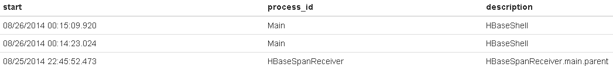
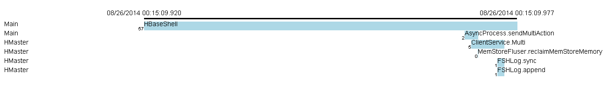

htrace-hbase
============

htrace-hbase provides the span receiver which sends tracing spans to HBase
and the viewer which retrieves spans from HBase and show them graphically.


Tutorial
--------

We are using the same HBase instance running in standalone-mode as a tracee
and storage of tracing spans at the same time in this example.

At first, get HBase and build it.:

    $ git clone https://github.com/apache/hbase
    $ cd hbase
    $ mvn package -DskipTests

Putting jar of hbase-htrace on the classpath of HBase.:

    $ mkdir lib
    $ cp path/to/htrace/htrace-hbase/target/htrace-hbase-3.0.4.jar lib/

Adding configuration for span receiver to hbase-site.xml.:

    <property>
      <name>hbase.trace.spanreceiver.classes</name>
      <value>org.htrace.impl.HBaseSpanReceiver</value>
    </property>

Starting HBase server in standalone-mode.:

    $ bin/hbase master start

Running HBase shell from another terminal,
adding the table in which tracing spans stored.
It uses the table named "htrace" with two column families "s" and "i" by default.:

    hbase(main):001:0> create 'htrace', 's', 'i'

Run some tracing from hbase shell.:

    hbase(main):002:0> trace 'start'; create 't1', 'f'; trace 'stop'
    ...
    hbase(main):003:0> trace 'start'; put 't1', 'r1', 'f:c1', 'value'; trace 'stop'
    ...

Running the main class of receiver also generate simple trace for test.:

    $ bin/hbase org.htrace.impl.HBaseSpanReceiver

Starting viewer process which listens 0.0.0.0:16900 by default.:

    $ bin/hbase org.htrace.viewer.HBaseSpanViewerServer

Accessing http://host:16900/ with Web browser shows you list of traces like below.:



Clicking the trace in the list shows you the spans.:




Receiver Configuration
----------------------

Configurations for span receiver running in HBase
to connect to the HBase to which spans are sent.
These are different from the properties of usual HBase client.:

    <property>
      <name>hbase.htrace.hbase.collector-quorum</name>
      <value>127.0.0.1</value>
    </property>
    <property>
      <name>hbase.htrace.hbase.zookeeper.property.clientPort</name>
      <value>2181</value>
    </property>
    <property>
      <name>hbase.htrace.hbase.zookeeper.znode.parent</name>
      <value>/hbase</value>
    </property>

You can specify the name of table and column families
for storing tracing spans by configurations shown below.:

    <property>
      <name>hbase.htrace.hbase.table</name>
      <value>htrace</value>
    </property>
    <property>
      <name>hbase.htrace.hbase.columnfamily</name>
      <value>s</value>
    </property>
    <property>
      <name>hbase.htrace.hbase.indexfamily</name>
      <value>i</value>
    </property>

Notice that these configurations are prefixed by `hbase.`
because the tracee is assumed to be HBase here.


Viewer Configuration
--------------------

You can set listen address of span viewer server by `htrace.viewer.http.address`.
In addition, span viewer server uses 
- usual HBase client configuration to connect to HBase and
- receiver's configuration properties without prefix
  to specify the name of table and column families.

```
$ bin/hbase org.htrace.viewer.HBaseSpanViewerServer \
    -Dhtrace.viewer.http.address=0.0.0.0:16900 \
    -Dhbase.zookeeper.quorum=127.0.0.1 \
    -Dhbase.zookeeper.znode.parent=/hbase \
    -Dhtrace.hbase.table=htrace \
    -Dhtrace.hbase.columnfamily=s \
    -Dhtrace.hbase.indexfamily=i
```

Todo
----

- showing timeline annotation in spans view.
- showing parent-child relationships in spans view.
- enabling to focus in/out specific spans in trace.
- limiting the traces shown in list based on time period.
- adding utility shell script.
- adding tests.
